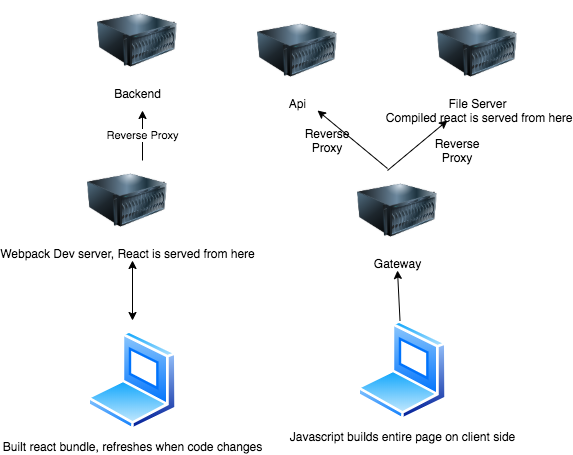

# LAB 4
# REACT TODOS
- `npm start` from client directory 
- Create a form with a button
- Add a button that toggles the visibility of another component
- Use an effect to fetch counter from server when page loads
- Reverse proxy to your backend server
- Fetch and display the current page count

# PRODUCTION BUILD
- `npm run build` in the client folder
- Start all servers
- Visit it at the port of the gateway

# Server todos
- Create an endpoint to increment and get a counter

# AWS Setup
https://docs.aws.amazon.com/AmazonRDS/latest/UserGuide/Concepts.RegionsAndAvailabilityZones.html

- Create an ec2 instance
- Pick free tier -> ubuntu
- Download pem file
- `sudo chmod 400 path/to/pem`
- ssh in with `ssh -i path/to/pem ubuntu@ipaddress`
- Install node and npm
- `sudo apt-get update`
- `sudo apt-get install nodejs`
- `sudo apt-get install npm`
- Install pm2 `sudo npm i pm2 -g`
- Start server on port 80 `sudo pm2 start gateway.js` 
- Start the other 2 servers
- build the client bundle
- Visit your server!

# React Modes
